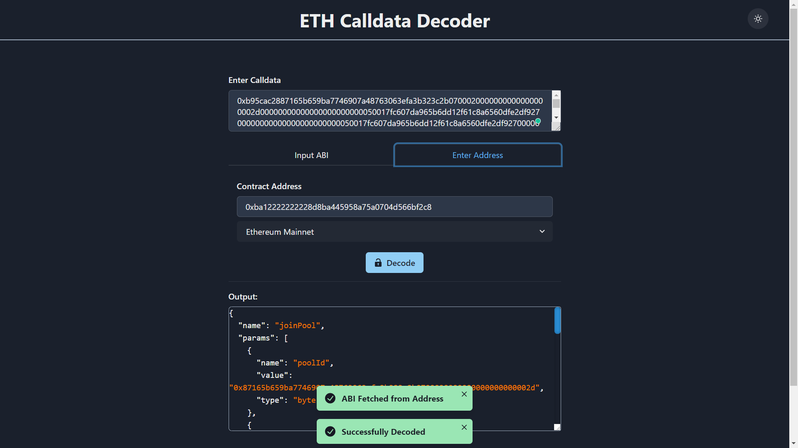
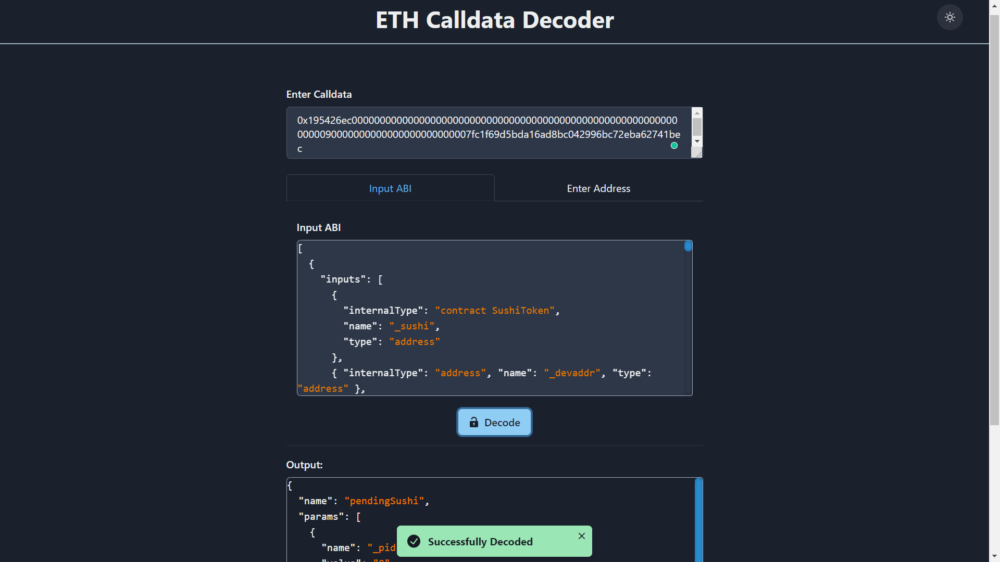

# ETH Calldata Decoder

Allows decoding of calldata via:

1. Contract Address (App automatically fetches ABI if the contract is verified on Etherscan, Polygonscan, etc.)
2. ABI (Manually enter any ABI)

## Website:

**[https://apoorvlathey.com/eth-calldata-decoder/](https://apoorvlathey.com/eth-calldata-decoder/)**

_PS:_ Supports Dark & Light Mode!

## Screenshots:

